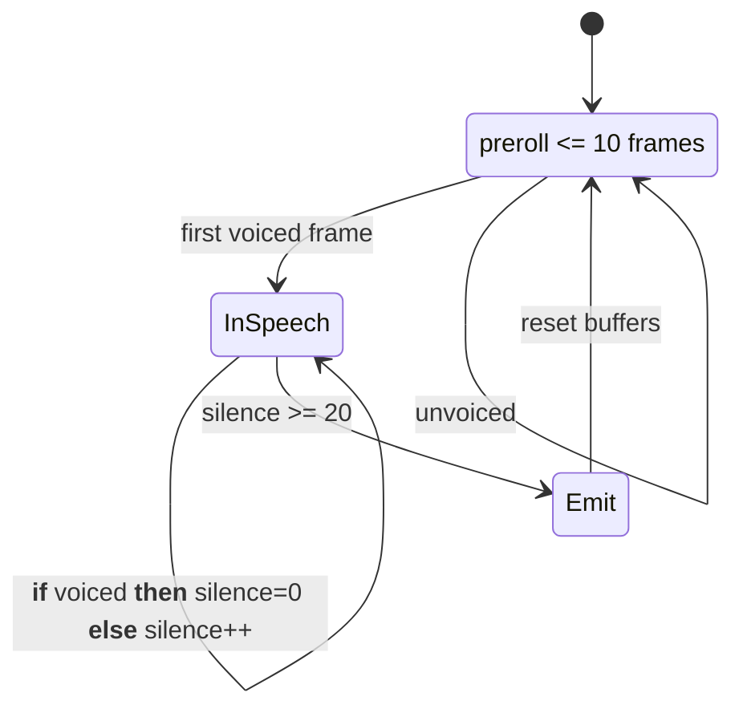

## 1. Goal

Define the design, behavior, and integration contract for the `VadService` component that segments continuous microphone audio into utterances using WebRTC VAD. The spec ensures consistent inputs/outputs, tunable parameters, edge-case handling, and pipeline interoperability.

## 2. Definitions

- VAD (Voice Activity Detection): Algorithm that detects whether a frame contains speech.
- Frame: A contiguous block of PCM samples processed as a unit by VAD; here 20 ms at 16 kHz mono 16-bit PCM (640 bytes).
- Preroll: Short buffer of frames captured immediately before the first detected voiced frame, added to the start of the utterance.
- Silence Threshold: Number of consecutive unvoiced frames required to terminate an utterance.
- Utterance: A contiguous segment of speech audio emitted as a single `AudioEvent`.
- WebRTC VAD: Open-source VAD used via `WebRtcVadSharp`.
- Pipeline Event: Application event carrying audio bytes and turn metadata (e.g., `AudioChunkEvent`).
- Turn: Conversation exchange unit tracked by `TurnManager` (current turn id/token).
- PCM 16-bit: Linear PCM sample format, little-endian, 16 bits per sample.

## 3. Requirements, Constraints & Guidelines

Requirements

- REQ-001: Detect voiced/unvoiced per 20 ms frame using WebRTC VAD in VeryAggressive mode.
- REQ-002: Support input as either raw 20 ms `byte[]` chunks or `AudioChunkEvent` with identical audio payloads.
- REQ-003: Maintain a preroll buffer of up to 10 frames, included at utterance start upon first voiced frame.
- REQ-004: Begin utterance capture on first voiced frame; continue appending subsequent frames to the utterance.
- REQ-005: Track consecutive unvoiced frames; when count >= 20, close the utterance.
- REQ-006: Emit an `AudioEvent` only if utterance duration > 0.8 seconds; otherwise consider utterance has no speech and so discard.
- REQ-007: On valid utterance emission, call `TurnManager.Interrupt()` before yielding the event.
- REQ-008: Construct emitted audio as `AudioData(bytes, 16000, 1, 16)`.

Constraints

- CON-001: Audio format must be 16 kHz, mono, 16-bit PCM. Frame size must be exactly 640 bytes (320 samples × 2 bytes).
- CON-002: `VadService` is not thread-safe; it maintains internal mutable state and must be used from a single pipeline thread (i.e. degree of parallelism should be 1).
- CON-003: Latency budget: termination latency equals silence threshold (20 frames ≈ 400 ms) plus downstream processing.
- CON-004: Memory usage grows with utterance length; entire utterance is buffered in memory before emit.
- CON-005: Changing sample rate, frame length, or channels requires coordinated changes to VAD parameters and frame sizing.

## 4. Design

Overview

`VadService` implements a simple streaming state machine around WebRTC VAD to produce speech segments with preroll and silence-based termination.

Key parameters (defaults)

- Frame length: 20 ms
- Preroll frames: 10 (max 200 ms)
- Silence threshold: 20 frames (≈ 400 ms)
- Min utterance duration: 0.8 s
- VAD mode: VeryAggressive
- Audio format: 16 kHz, mono, 16-bit PCM

Interfaces

C# methods (public surface):

- `IEnumerable<AudioEvent>` Transform(AudioChunkEvent audioChunkEvent)
- `IEnumerable<AudioEvent>` Transform(byte[] audioChunk)

Inputs/Outputs

- Input: 20 ms PCM16 frames as `byte[]` or wrapped in `AudioChunkEvent`.
- Output: Zero or more `AudioEvent` instances. Each event contains `AudioData` and current turn metadata from `TurnManager`.

State machine

- Idle/Prerolling: Enqueue incoming frames up to 10. If a voiced frame arrives, transition to InSpeech and prepend all queued frames to the utterance.
- InSpeech: Append each frame. Reset silence counter on voiced frames. Increment silence counter on unvoiced frames.
- Terminate: When silence counter reaches 20, evaluate utterance duration; if > 0.8 s, call `TurnManager.Interrupt()`, emit `AudioEvent`; then clear buffers and return to Idle.

